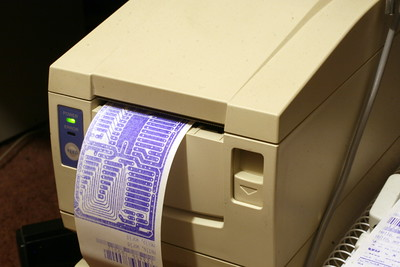

# microprinter

Some code to drive the Citizen CBM 1000 till-receipt printer.
It can print text, graphics and barcodes. The C source
here is very much a work-in-progress and has some sections #ifdefed
out for development. What's left in place is a routine that will
print a PBM file (text format), which we use as a way to give
people a QR code that represents the Bristol Hackspace URL.

## The Printer

The Citizen CBM 1000 is a till-receipt printer that prints on
thermal paper.
It has a serial (RS-232) interface that can be connected to
a modern PC via a USB-to-serial adaptor cable and a 9-to-25 pin
converter.
It accepts ASCII text and uses escape sequences to control special
effects such as boldface and underlining.
Escape sequences are also used to send bit-mapped graphics to the
printer.

Later versions of the printer have a USB interface built-in.
